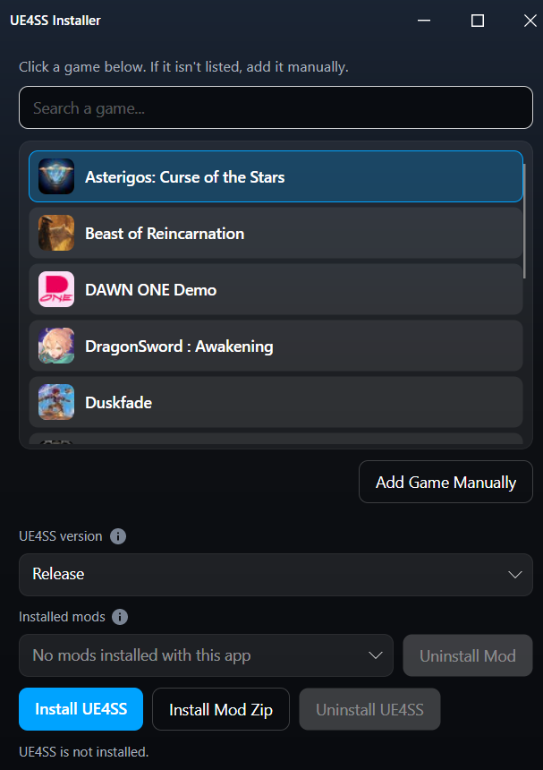

# UE4SS Installer

A small desktop app for installing [UE4SS](https://github.com/UE4SS-RE/RE-UE4SS) into Unreal games. Pick a Steam title, choose **Release** or **zDev**, and install. Optional: drop in a community mod zip.

This is a community installer. It is not affiliated with Epic Games or the UE4SS project.

<p align="center">
  
</p>

## Use it

1. Open the app. It scans Steam for Unreal games (`Binaries/Win64`, skipping Engine copies).
2. Click a game. If it is missing, **Add Game Manually** and pick the Steam install folder (Manage → Browse local files). You never need to pick the `.exe`.
3. Choose **Release** or **zDev**.
4. **Install UE4SS**.

**Release** is the newest `UE4SS_v*.zip` on the `experimental-latest` tag. **zDev** is the newest `zDEV-UE4SS_v*.zip` from that same tag. GitHub’s `/releases/latest` is not used; that channel is currently frozen.

After one install with this app, switching channels cleans files this installer previously extracted. Manual UE4SS copies are not tracked, so leftovers can remain until you install once through the app.

Same-channel updates keep `UE4SS-settings.ini`. Switching Release ↔ zDev overwrites it. Mods you added that are not in the UE4SS zip are left alone.

**Uninstall UE4SS** deletes the `ue4ss` folder (mods and signatures included) and Win64-root UE4SS DLLs such as `dwmapi.dll`. Close the game first if a file is locked.

## Known signature packs

Some games need extra Lua files in `ue4ss/UE4SS_Signatures`. When the selected game matches a known pack, **Install UE4SS** first extracts UE4SS, then downloads that pack’s latest GitHub release zip and copies the `.lua` files into `ue4ss/UE4SS_Signatures`. zDev already ships that folder; Release often does not, so the installer creates it after UE4SS is in place. If `ue4ss/` is missing, signatures are skipped — they are never copied next to the game exe.

Currently included:

- [Mortal Shell II](https://github.com/mattdavida/MortalShell2-UE4SS-Fix) (`StaticConstructObject.lua`)
- [Witchfire](https://github.com/mattdavida/Witchfire-ue4ss-fix) (`ConsoleManager.lua`, plus `EngineVersionOverride` 4.27 in `UE4SS-settings.ini`)

Signature files are not added to the UE4SS manifest, so a later channel switch will not delete them. They are overwritten on the next install.

## Install a mod zip

**Install Mod Zip** looks at the archive (and one wrapper folder, if present):

- Full pack (`dwmapi.dll` + `ue4ss/`) or a `ue4ss/` overlay → extracted into `Binaries/Win64`
- Anything else → extracted into `ue4ss/Mods` (a leading `Mods/` folder is stripped)

Mod files installed with this app are listed under **Installed mods** and can be removed with **Uninstall Mod**. Files that belong to UE4SS itself are left alone. Manual copies into `Mods` are not listed (a later folder scan can reconcile those).

## Steam Deck / Linux

Proton Unreal games still use `Binaries/Win64`. After you download the Linux build, mark it executable:

```bash
chmod +x UE4SSInstaller
```

## Build from source

Requires the [.NET 9 SDK](https://dotnet.microsoft.com/download).

```bash
dotnet run
```

Standalone builds (no .NET install on the target machine). One file: `UE4SSInstaller.exe` on Windows, `UE4SSInstaller` on Linux.

```powershell
.\deploy.ps1          # win-x64
.\deploy.ps1 -Linux   # linux-x64
.\deploy.ps1 -All     # both
```

Windows output: `bin/Release/net9.0/win-x64/publish/UE4SSInstaller.exe`  
Linux output: `bin/Release/net9.0/linux-x64/publish/UE4SSInstaller`

Copy that file anywhere and run it. First launch unpacks native graphics libs into a cache, so it can take a few extra seconds.

A GitHub account is not required. Listing the UE4SS zip uses GitHub's public API (about 60 requests per hour per IP, unauthenticated). The zip download itself does not use that quota. Optional: set `UE4SS_INSTALLER_GITHUB_TOKEN` to a token with public-repo read if you hit that listing limit on a shared network. Do not put a token in the shipped exe.

## Credits

UE4SS is [UE4SS-RE/RE-UE4SS](https://github.com/UE4SS-RE/RE-UE4SS). This app only downloads the `experimental-latest` zips and copies them into the game folder you choose.
